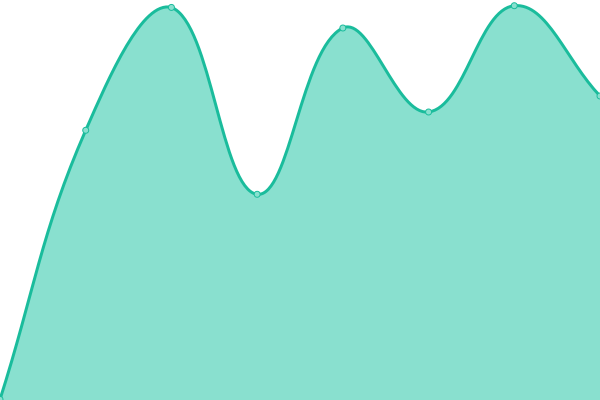
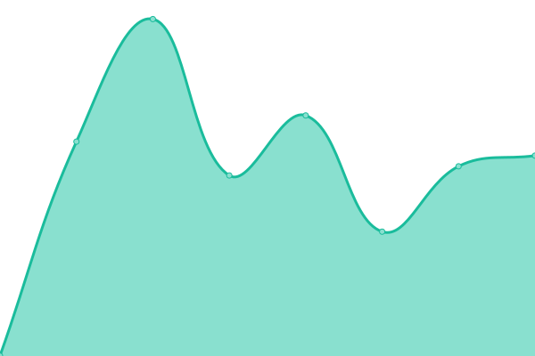
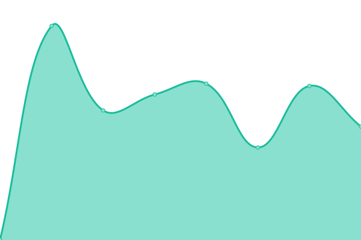

# [📈 Live Status](https://status.gollob.dev): <!--live status--> **🟩 All systems operational**

This repository contains the open-source uptime monitor and status page for [Sebastian Gollob](gollob.dev), powered by [Upptime](https://github.com/upptime/upptime).

With [Upptime](https://upptime.js.org), you can get your own unlimited and free uptime monitor and status page, powered entirely by a GitHub repository. We use [Issues](https://github.com/sebastiangollob/uptime-monitor/issues) as incident reports, [Actions](https://github.com/sebastiangollob/uptime-monitor/actions) as uptime monitors, and [Pages](https://status.gollob.dev) for the status page.

<!--start: status pages-->
<!-- This summary is generated by Upptime (https://github.com/upptime/upptime) -->
<!-- Do not edit this manually, your changes will be overwritten -->
<!-- prettier-ignore -->
| URL | Status | History | Response Time | Uptime |
| --- | ------ | ------- | ------------- | ------ |
|  [ASCII](https://ascii.ist.tugraz.at) | 🟩 Up | [ascii.yml](https://github.com/kochge/uptime-monitor/commits/HEAD/history/ascii.yml) | 

 2266ms
     
 | 

<a href="https://kochge.github.io/uptime-monitor/history/ascii">100.00%</a>
    

|  [ASCII, PNG only](https://ascii.ist.tugraz.at/images/pages/404.png) | 🟩 Up | [ascii-png-only.yml](https://github.com/kochge/uptime-monitor/commits/HEAD/history/ascii-png-only.yml) | 

 236ms
     
 | 

<a href="https://kochge.github.io/uptime-monitor/history/ascii-png-only">100.00%</a>
    

|  [Infisical](https://secrets.quantix-core.com) | 🟩 Up | [infisical.yml](https://github.com/kochge/uptime-monitor/commits/HEAD/history/infisical.yml) | 

 404ms
     
 | 

<a href="https://kochge.github.io/uptime-monitor/history/infisical">100.00%</a>
    

|  [SHARE](https://share.catrob.at) | 🟩 Up | [share.yml](https://github.com/kochge/uptime-monitor/commits/HEAD/history/share.yml) | 

 958ms
     
 | 

<a href="https://kochge.github.io/uptime-monitor/history/share">100.00%</a>
    

|  [JENKINS](https://jenkins.catrob.at) | 🟩 Up | [jenkins.yml](https://github.com/kochge/uptime-monitor/commits/HEAD/history/jenkins.yml) | 

 703ms
     
 | 

<a href="https://kochge.github.io/uptime-monitor/history/jenkins">100.00%</a>
    

<!--end: status pages-->

[**Visit our status website →**](https://status.gollob.dev)

## 📄 License

- Powered by: [Upptime](https://github.com/upptime/upptime)
- Code: [MIT](./LICENSE) © [Anand Chowdhary](https://anandchowdhary.com), supported by [Pabio](https://pabio.com)
- Data in the `./history` directory: [Open Database License](https://opendatacommons.org/licenses/odbl/1-0/)
